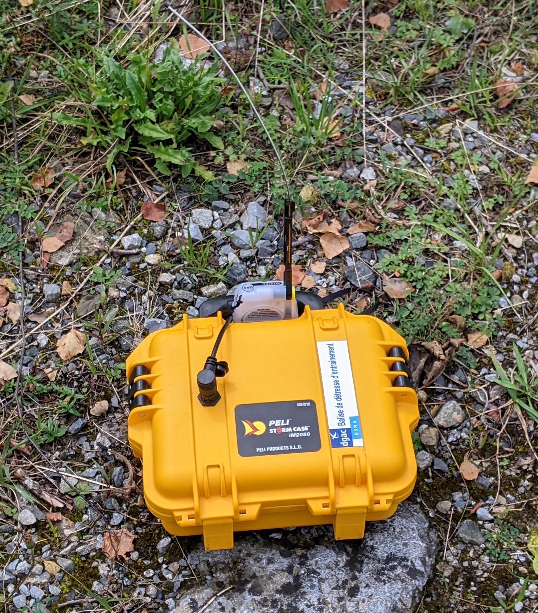

# Sarsat JRX
Cospas/Sarsat 406MHz beacon decoder based on an ESP32 module.
This project was inspired by the work of F4GMU and F1LVT.

Field use during a SATER exerciser with Ardrasec 31 :

# Hardware
Input stage is based on F1LVT's "deriv-audio" board : http://www.f1lvt.com/files/346-DerivAudio-P3.90.pdf
Second stage is F1LVT's signal shaping stage from DECTRA decoder : http://www.f1lvt.com/files/333E-ConstructionDECTRA2274-P1-English.67.pdf
Audio signal can be provided by either the audio ouput of a receiver (in my case a FT3D portable) or from a NiceRF SA818-S UHF module.

